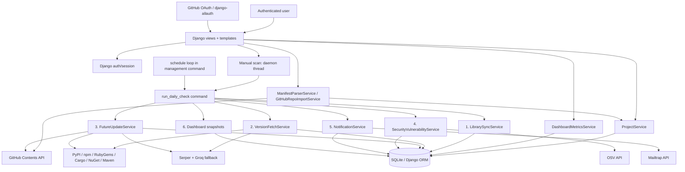
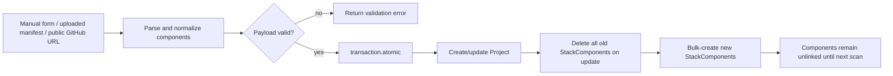
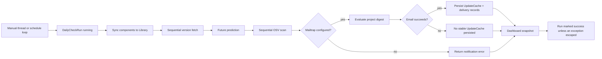
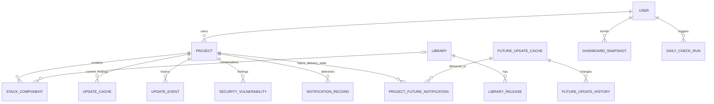
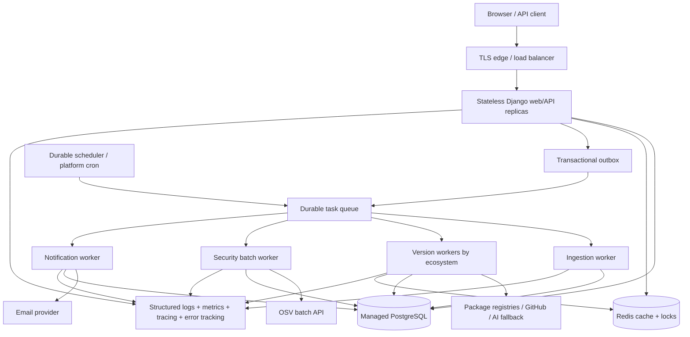
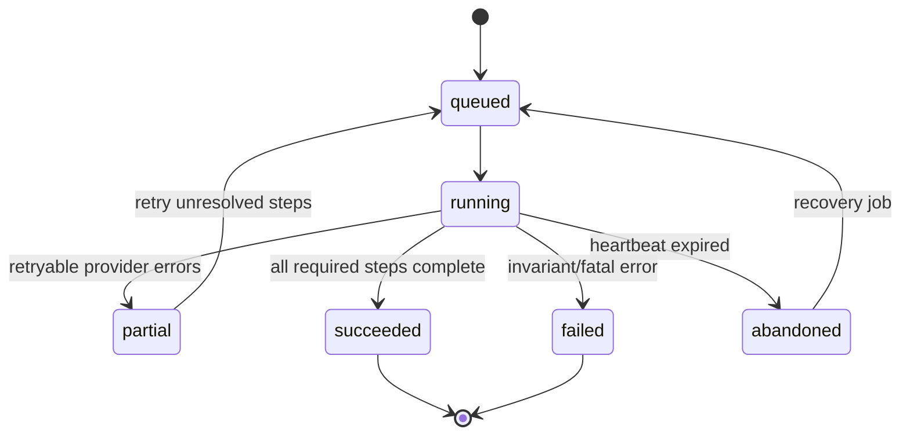

# LibTrack AI 4.0 — As-Built Architecture और SaaS Reliability Audit

यह दस्तावेज़ repository की मौजूदा working tree को पढ़कर बनाया गया है। इसका उद्देश्य generic architecture सुझाना नहीं, बल्कि अभी के वास्तविक flow को दर्ज करना, failure points को प्राथमिकता देना और production-grade SaaS target तय करना है।

## 1. Executive assessment

LibTrack AI का domain decomposition अच्छा है: Django views के पीछे service classes हैं, dependency metadata को central `Library` model में रखने का प्रयास है, owner-scoped access मौजूद है, security scanning, future prediction, notification history और dashboard snapshots अलग models में हैं।

लेकिन वर्तमान runtime अभी fault-tolerant SaaS नहीं है। चार सबसे महत्वपूर्ण blockers हैं:

1. Manual scans web process के daemon thread में चलते हैं और scheduled scans एक long-running management process पर निर्भर हैं।
2. Stable update detection को notification delivery से जोड़ा गया है; email fail/pause होने पर update state dashboard तक नहीं पहुँचती।
3. Canonical package identity में ecosystem शामिल नहीं है; समान package name वाले npm/PyPI/RubyGems artifacts गलत `Library` record share कर सकते हैं।
4. SQLite, local file logs और missing production security/runtime configuration horizontal scaling और reliable deployment रोकते हैं।

## 2. मौजूदा architecture (as built)

## 3. वास्तविक product flows

### 3.1 Project onboarding/import

अच्छा भाग: project write transaction में है। Risk: update पर dependencies पूरी तरह delete/recreate होती हैं, लेकिन पुराने `UpdateCache` findings reconcile नहीं होते।

### 3.2 Daily scan

यहाँ मुख्य flow break है: detection truth और delivery truth अलग नहीं हैं।

## 4. Data model map

## 5. क्या अच्छा implement हुआ है

### Service boundaries

`tracker/services/` में project writes, manifest parsing, version fetch, future updates, security, metrics और notifications अलग हैं। यह आगे workers में split करने के लिए अच्छी foundation है।

### Tenant ownership

User-facing project, history, future-update और security queries owner से filter होते हैं। Project update/delete भी `_user_projects_queryset()` के माध्यम से scoped हैं।

### Transactional project writes

`ProjectService.save_project_from_payload()` project और components को `transaction.atomic()` में बदलता है। आधा project save होने का risk कम है।

### Audit और deduplication primitives

`UpdateEvent`, `NotificationRecord`, `DailyCheckRun`, `FutureUpdateHistory`, unique constraints और per-project future notification state production observability/idempotency की अच्छी शुरुआत हैं।

### External-call safeguards

Registry, GitHub और OSV requests में timeouts हैं। Email delivery में retry/backoff और attempt records हैं।

### Test coverage की अच्छी शुरुआत

- 73 deterministic tests पास हुए।
- 33 live-registry tests में 32 पास हुए; Maven Central call timeout हुआ।
- कुल observed result: 105/106 pass.
- `makemigrations --check --dry-run`: clean.
- दो timezone warnings मौजूद हैं।

## 6. Findings, impact और fixes

### P0 — Durable background execution नहीं है

**Evidence**

- `tracker/views.py:191-196` manual scan को daemon `threading.Thread` में शुरू करता है।
- `tracker/management/commands/run_daily_check.py:121-130` scheduler process को infinite loop में चलाता है।

**Impact**

- Web deploy/restart/worker timeout पर job बिना recovery के मर सकती है।
- Multiple web replicas duplicate scans शुरू कर सकते हैं।
- Thread/process crash के बाद `DailyCheckRun` हमेशा `queued` या `running` रह सकता है।

**Fix**

- Redis-backed Celery/Dramatiq/RQ queue और अलग worker process।
- Scheduler के लिए Celery Beat या platform cron जो केवल durable task enqueue करे।
- `ScanRun` lease, heartbeat, idempotency key, per-step status और stale-run recovery।
- Database-backed unique active-run guard या distributed lock।

### P0 — Detection और email delivery गलत तरीके से coupled हैं

**Evidence**

- `tracker/services/notification_service.py:710-720` update केवल payload बनता है।
- `tracker/services/notification_service.py:855-878` `UpdateCache` email success के बाद लिखा जाता है।
- Paused project `tracker/services/notification_service.py:112-119` पर update evaluation से पहले लौट जाता है।

**Impact**

- Mailtrap outage, missing credentials या paused notifications dashboard को false “up to date” दिखा सकते हैं।
- Detection data product truth नहीं रहता; email provider product state तय करने लगता है।

**Fix**

1. Scan stage में `DependencyFinding`/`UpdateCache` को हमेशा upsert करें।
2. Notification policy अलग stage में persisted findings पढ़े।
3. Transactional outbox में notification event लिखें।
4. Delivery worker retry करे; `NotificationRecord` केवल delivery truth रखे।

### P0 — Stale update findings reconcile नहीं होते

**Evidence**

- `UpdateCache` creation/update notification success पर होता है।
- Normal scan path में obsolete `UpdateCache` delete/resolve करने का कोई reconciliation नहीं है।
- Project edit पुराने components delete/recreate करता है (`tracker/services/project_service.py:219-233`)।

**Impact**

- User dependency upgrade या removal के बाद dashboard/history stale update दिखा सकते हैं।
- Health score समय के साथ unreliable हो सकता है।

**Fix**

- Finding में `status = active|resolved|ignored`, `first_seen_at`, `last_seen_at`, `resolved_at` रखें।
- हर successful project scan के अंत में unseen active findings resolve करें।
- Finding identity project dependency FK पर आधारित हो, free-text library name पर नहीं।

### P0 — Package identity ecosystem-safe नहीं है

**Evidence**

- `LibrarySyncService` normalized name key पर `get_or_create` करता है (`tracker/services/library_sync_service.py:67-82`)।
- Registry/ecosystem canonical identity का भाग नहीं है।
- `Library.name` globally unique है, जबकि npm, PyPI और अन्य registries में एक ही नाम हो सकता है।

**Impact**

- Cross-ecosystem name collision गलत latest version, vulnerability mapping और notifications दे सकती है।
- गलत registry hint कई unnecessary external calls कराता है।

**Fix**

- `Package(ecosystem, normalized_name)` पर case-normalized unique constraint।
- npm scope, Maven coordinates और registry-specific canonicalization।
- `ProjectDependency` में installed version/spec, direct/dev/transitive scope, manifest source और package FK।

### P0 — SQLite SaaS database नहीं है

**Evidence**

- `libtrack_ai/settings.py:60-65` केवल local SQLite configure करता है।

**Impact**

- Multiple workers और concurrent scan writes पर lock contention।
- HA, managed backups, read replicas और zero-downtime operations सीमित।

**Fix**

- Managed PostgreSQL; `DATABASE_URL`, connection health checks, backups और restore drill।
- SQLite केवल local development/test में रखें।

### P1 — Run status errors को success दिखा सकता है

**Evidence**

- Missing Mailtrap credentials structured error लौटाता है।
- Fetch/security/notification services `error_count` लौटाते हैं।
- Orchestrator escaped exception न होने पर हमेशा `status="success"` लिखता है।
- Model में `partial` status है, पर runtime में उपयोग नहीं होता।

**Impact**

- Dashboard/operations green दिखेंगे जबकि registries, OSV या email fail हुए हों।

**Fix**

- Step-level states और failure policy।
- किसी required step में errors हों तो `partial`; fatal invariant failure पर `failed`।
- Summary में `degraded_reasons` और retryable/non-retryable classification।

### P1 — Concurrency guard race-safe नहीं है

**Evidence**

- View पहले active run `exists()` check करती है, फिर अलग statement में run create करती है।

**Impact**

- दो simultaneous requests दोनों check पास करके duplicate owner/global runs शुरू कर सकती हैं।

**Fix**

- PostgreSQL advisory lock या Redis lock।
- Active scope के लिए database-enforced lease/unique strategy।
- Task idempotency key जैसे `owner_id + scan_window`.

### P1 — Sequential network fan-out scale नहीं करेगा

**Evidence**

- Libraries sequential loop में fetch होती हैं।
- हर library के आसपास rate-limit sleep दो स्तरों पर हो सकता है।
- OSV हर component पर अलग request करता है, जबकि OSV batch endpoint उपलब्ध architecture choice हो सकती है।

**Impact**

- Tenant और dependency count बढ़ने पर scan duration linear/बहुत लंबी होगी।
- एक slow provider पूरे run को delay करता है।

**Fix**

- Ecosystem/provider-aware queues और bounded concurrency।
- Shared package result cache with TTL/ETag।
- Exponential backoff + jitter, circuit breaker और provider budgets।
- OSV batch queries तथा fan-out/fan-in scan aggregation।

### P1 — Default test suite external APIs पर निर्भर है

**Evidence**

- Registry test files स्पष्ट रूप से real API calls करते हैं।
- Full sandbox run में 27 network failures हुए; network-enabled rerun में केवल Maven timeout बचा।

**Impact**

- CI flaky, slow और offline development unreliable।

**Fix**

- Default suite में recorded fixtures/mocked responses।
- Live tests को `@pytest.mark.integration`/`live` के पीछे रखें।
- CI: fast deterministic suite हर commit पर; live contract tests scheduled/nightly।

### P1 — Production hardening और runtime packaging अधूरा है

**Evidence**

- `check --deploy` ने HSTS, HTTPS redirect, secure session cookie, secure CSRF cookie, weak fallback secret और current DEBUG warning दी।
- Requirements में production application server नहीं है।
- Static serving strategy, container/process definitions और CI config repository में नहीं हैं।

**Fix**

- Fail-fast production settings module; missing secret पर startup fail।
- Proxy SSL header, allowed hosts, CSRF trusted origins, secure cookies, HTTPS और staged HSTS।
- Gunicorn/Uvicorn, WhiteNoise या CDN/object storage।
- Dockerfile/process definitions, readiness/liveness endpoints और migration release step।

### P2 — Configuration drift

**Evidence**

- Settings में `LIBTRACK_USE_OFFICIAL_APIS` है, command अलग `USE_OFFICIAL_APIS` env पढ़ता है।
- `LIBTRACK_ENABLE_EMAIL_NOTIFICATIONS` defined है, लेकिन runtime notification gate में उपयोग नहीं होता।

**Impact**

- Operator environment बदलता है पर application expected behavior नहीं बदलता।

**Fix**

- Typed settings object; एक canonical env name; startup validation और configuration tests।

### P2 — Timezone consistency

**Evidence**

- Tests ने timezone-aware mode में naive datetime warnings दिखाईं।
- Version writes में `datetime.now()` उपयोग है।

**Fix**

- Django model timestamps के लिए `timezone.now()` और UTC-aware parsing।
- Warnings को CI failure बनाना जब baseline clean हो।

### P2 — Metrics semantics

Health score `updates + 2 * vulnerabilities` को total components से divide करता है। एक component update और vulnerability दोनों होने पर double-count होता है। यह useful prioritization score है, पर “dependency health” का objectively verified प्रतिशत नहीं।

**Fix**

- Metric का नाम risk score रखें, या per-dependency mutually exclusive state derive करें।
- Scan completeness/staleness को अलग metric बनाएं; failed/unscanned dependency को healthy न मानें।

### P2 — SaaS tenancy अभी single-owner है

`Project.owner` और CSV developer emails MVP के लिए ठीक हैं, लेकिन team SaaS के लिए Workspace/Organization, memberships, roles, invitations, audit log, verified email और plan quotas चाहिए।

## 7. Recommended target architecture

## 8. Target scan state machine

हर step idempotent होना चाहिए। Retry पूरे scan को दोबारा email न भेजे; persisted finding और outbox event dedupe keys इस invariant को enforce करें।

## 9. Implementation roadmap

### Phase A — Correctness first

- Detection persistence को email से अलग करें।
- Active/resolved finding reconciliation लागू करें।
- `DailyCheckRun.partial`, step errors और truthful status लागू करें।
- Ecosystem-aware package identity migration design करें।
- Configuration drift और timezone warnings ठीक करें।

### Phase B — Durable runtime

- PostgreSQL पर migrate करें।
- Redis + durable task queue + worker + scheduler जोड़ें।
- Distributed locks, heartbeat और stale-run recovery जोड़ें।
- Web-triggered scan केवल task enqueue करे।

### Phase C — Production delivery

- Production settings harden करें।
- Gunicorn/Uvicorn, static strategy, container/process definitions और health endpoints।
- CI pipeline: lint, deterministic tests, migrations check, deploy check, dependency/security scan।
- Structured observability और alerts।

### Phase D — Scale and SaaS model

- Provider batching, bounded concurrency, caching और circuit breakers।
- Workspace/membership/RBAC/invitations।
- Verified email, quotas, billing entitlement और audit log।
- Data retention, backups, restore testing और incident runbooks।

## 10. Definition of “never silently fail”

पूर्ण guarantee संभव नहीं, पर system को इन invariants के करीब बनाया जा सकता है:

1. Accepted scan task durable storage में रहे।
2. हर run/step का visible state, timestamps और heartbeat हो।
3. Retry idempotent हो और duplicate email न भेजे।
4. Detection state email provider से independent हो।
5. Provider outage run को `partial/degraded` दिखाए, `success` नहीं।
6. Stale jobs automatically recover हों।
7. Active findings successful scan के बाद reconcile हों।
8. Backups का restore नियमित रूप से verify हो।
9. Alerts user-visible और operator-visible दोनों हों।
10. Deployment health checks external dependencies और queue lag की स्थिति expose करें।

