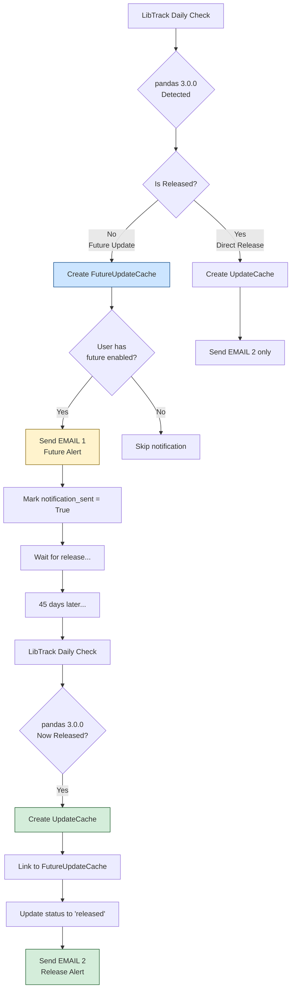

# Dual Notification Flow - Complete Example

## YES! Developers Get TWO Separate Emails

When a future update is detected and then released, developers receive **TWO distinct emails**:

## Example Timeline: pandas 3.0.0

### Day 1 (December 5, 2025) - Future Update Detected

**What happens:**
```
LibTrack AI detects pandas 3.0.0 is planned (not yet released)
├─> Creates FutureUpdateCache entry
│   ├─ Library: pandas
│   ├─ Version: 3.0.0
│   ├─ Confidence: 92%
│   ├─ Expected: January 19, 2026
│   └─ Status: confirmed
└─> Sends EMAIL 1
```

#### 📧 EMAIL 1: Future Update Alert

**Subject:** `🔮 Future Update Alert: pandas 3.0.0 Planned`

**Content:**
```
┌─────────────────────────────────────────────────────────────┐
│ Hello Team,                                                  │
│                                                              │
│ LibTrack AI detected upcoming planned update activity       │
│ impacting the Data Analytics Platform project.              │
│                                                              │
│ ┏━━━━━━━━━━━━━━━━━━━━━━━━━━━━━━━━━━━━━━━━━━━━━━━━━━━━━┓  │
│ ┃ FUTURE UPDATE NOTICE (confidence: 92%)              ┃  │
│ ┃                                                      ┃  │
│ ┃ This is a planned/upcoming release that has         ┃  │
│ ┃ NOT been officially released yet.                   ┃  │
│ ┃                                                      ┃  │
│ ┃ You'll receive another notification when this       ┃  │
│ ┃ version is officially released.                     ┃  │
│ ┗━━━━━━━━━━━━━━━━━━━━━━━━━━━━━━━━━━━━━━━━━━━━━━━━━━━━━┛  │
│                                                              │
│ Library     │ Type    │ Version │ Category │ Expected       │
│ ──────────────────────────────────────────────────────────  │
│ pandas      │ library │ 3.0.0   │ Future   │ 2026-01-19    │
│                                              │ Confidence 92% │
│                                                              │
│ Planned Features:                                           │
│ • Major rewrite with improved performance                   │
│ • New nullable integer dtype                                │
│ • Better memory efficiency                                  │
│ • Native string arrays                                      │
│                                                              │
│ Best regards,                                                │
│ LibTrack AI                                                  │
└─────────────────────────────────────────────────────────────┘
```

**Developer Action:** Alice can now start planning the upgrade, reviewing breaking changes, testing in dev environment.

---

### Day 45 (January 19, 2026) - Version Released

**What happens:**
```
pandas 3.0.0 is officially released
├─> Creates UpdateCache entry
│   ├─ Library: pandas
│   ├─ Version: 3.0.0
│   ├─ Category: major
│   └─ Release date: 2026-01-19
├─> Links to FutureUpdateCache
│   ├─ future_update.promoted_to_release → UpdateCache
│   └─ future_update.status → 'released'
└─> Sends EMAIL 2
```

#### 📧 EMAIL 2: Release Notification

**Subject:** `pandas 3.0.0 Released`

**Content:**
```
┌─────────────────────────────────────────────────────────────┐
│ Hello Team,                                                  │
│                                                              │
│ LibTrack AI detected recent update activity                 │
│ impacting the Data Analytics Platform project.              │
│                                                              │
│ Library     │ Type    │ Version │ Category │ Release Date   │
│ ──────────────────────────────────────────────────────────  │
│ pandas      │ library │ 3.0.0   │ Major    │ 2026-01-19    │
│                                                              │
│ Release Summary:                                             │
│                                                              │
│ pandas 3.0.0                                                 │
│ pandas 3.0.0 has been officially released with major        │
│ performance improvements, new nullable integer dtype,       │
│ better memory management, and native string arrays.         │
│                                                              │
│ [Read release notes] ──> Official documentation             │
│                                                              │
│ Kindly schedule upgrades or mitigations as appropriate.     │
│                                                              │
│ Best regards,                                                │
│ LibTrack AI                                                  │
└─────────────────────────────────────────────────────────────┘
```

**Developer Action:** Alice can now proceed with the actual upgrade, knowing it's officially available.

---

## Complete Flow Diagram



---

## Key Differences Between Emails

| Aspect | EMAIL 1 (Future) | EMAIL 2 (Released) |
|--------|------------------|-------------------|
| **Subject** | 🔮 Future Update Alert: pandas 3.0.0 Planned | pandas 3.0.0 Released |
| **Banner** | Yellow "Future Update Notice" | No banner |
| **Confidence** | Shows 92% confidence | No confidence (it's released!) |
| **Date** | Expected: 2026-01-19 | Released: 2026-01-19 |
| **Warning** | "NOT been officially released yet" | No warning |
| **Urgency** | Plan ahead | Action needed |
| **Content** | Planned features & roadmap | Actual release notes |
| **Action** | Start planning | Proceed with upgrade |

---

## Database State

### After Email 1 (Future)
```python
FutureUpdateCache:
├─ library: "pandas"
├─ version: "3.0.0"
├─ confidence: 92
├─ status: "confirmed"
├─ notification_sent: True
└─ promoted_to_release: None
```

### After Email 2 (Released)
```python
FutureUpdateCache:
├─ library: "pandas"
├─ version: "3.0.0"
├─ confidence: 92
├─ status: "released"  ← Changed!
├─ notification_sent: True
└─ promoted_to_release: UpdateCache#64  ← Linked!

UpdateCache:
├─ library: "pandas"
├─ version: "3.0.0"
├─ category: "major"
├─ release_date: "2026-01-19"
└─ future_predictions: [FutureUpdateCache#12]  ← Linked!
```

---

## Developer Experience

### 1️⃣ Day 1 - Future Alert Received
```
✉️  "pandas 3.0.0 is coming in ~45 days (92% confidence)"
    ↓
💭 Alice thinks: "Let me start preparing..."
    ↓
🔧 Actions:
   • Review breaking changes
   • Test in dev environment
   • Update dependencies
   • Plan rollout strategy
```

### 2️⃣ Day 1-45 - Preparation Period
```
📝 Alice has 45 days to:
   • Read migration guides
   • Test compatibility
   • Update code
   • Prepare team
```

### 3️⃣ Day 45 - Release Alert Received
```
✉️  "pandas 3.0.0 is NOW officially released"
    ↓
💭 Alice thinks: "Great! We're already prepared!"
    ↓
🚀 Actions:
   • Execute upgrade (already tested)
   • Deploy to staging
   • Monitor for issues
   • Roll out to production
```

---

## Code Example

```python
from tracker.tests.example_dual_notification_flow import *

# Run the complete example
result = example_dual_notification_flow()

# Outputs:
# ✓ Email 1 sent: True (Future alert)
# ✓ Email 2 sent: True (Release notification)
```

---

## Benefits of Dual Notification

### For Developers
- ⏰ **Early warning** - Know what's coming before it's released
- 🎯 **Better planning** - Time to prepare and test
- 📊 **Risk reduction** - No surprise breaking changes
- ✅ **Smoother upgrades** - Already prepared when released

### For Projects
- 🔄 **Continuous updates** - Stay current without panic
- 📈 **Better tracking** - Full lifecycle documented
- 🎓 **Learning opportunity** - Review changes before they land
- 💪 **Confidence** - Know exactly what's changing and when

---

## To Test This Yourself

```bash
# Run the dual notification example
python tracker/tests/example_dual_notification_flow.py

# You'll see:
# - Email 1 preview (future alert)
# - Email 2 preview (release notification)
# - Complete timeline
# - Email comparison table
```
